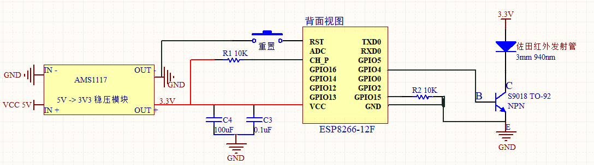

# 目前已实现功能
- 工作日早上6:40开客厅顶灯，非工作日不开灯。
- 工作日6:46 播放当日天气和路况 ，提示是否开窗，非工作日不播报
- 工作日8:00-22:00 （非工作日9:00-22:00）增加了整点和半点使用布谷鸟报时，并根据中国的假期安排调整播报时间。using omxplayer instead of vlc . 
- 天亮后一个小时自动关闭顶灯
- 家人回来(qingqingiphone,iphone,r9plus)，如果天黑前1小时之后，开客厅灯
- 天黑前1小时，如果是非工作日且家里有人，开客厅灯
- 在22:00自动关闭客厅顶灯
- 加入了ha-inkwavemap，本地化 Home Assistant 的地图面板
- 晚上9点左右，提醒孩子刷牙，读书，休息等。
- 语音识别：播放/关闭音乐，控制客厅/主卧/卧室灯具
- 定时让主卧esp8266 休眠达到省电的目的。

> 考虑是否要做次卧的控制

# ESP8266电路图

# MAC地址表
hostname|mac|IP
---|---|---
Tiger NetCom|00:17:13:1F:18:D9|192.168.88.170
rock64 | 1E:EF:FC:28:0C:BA|192.168.88.141
xiaoB | B8:27:EB:6C:F9:BC|192.168.88.140
MIMAX2-GENGXINFU|50:8F:4C:6E:E8:07|192.168.88.101
xiaoMi-LivingROOM|28:6C:07:74:49:6C|192.168.88.31
MAM-VIVO|44:66:FC:17:03:AF|192.168.88.14
ESP8266_ciwo|5C:CF:7F:C0:03:24|192.168.88.13
gree-keting|34:EA:34:C4:45:55|192.168.88.12
xiaoMi-BedROOM|F0:B4:29:93:33:25|192.168.88.11
ESP8266_zhuwo|5C:CF:7F:68:22:B8|192.168.88.10
ESP8266_keting|18:FE:34:CB:84:8E|192.168.88.9
Skybox|F4:4C:70:B3:E1:91|192.168.88.8
Hangzhou Hikvision Digital Techn|C0:56:E3:8E:4A:19|192.168.88.7
fuqingqngdeiPad|5C:F5:DA:4E:F2:3D|192.168.88.6
qingqindeiPhone|9C:4F:DA:87:2F:7C|192.168.88.4
R9PLUS|C0:9F:05:32:48:31|192.168.88.3|
chenfeideMBP|A0:99:9B:0D:6B:0B|192.168.88.2
iphone|00:61:71:A8:38:24|192.168.88.1
