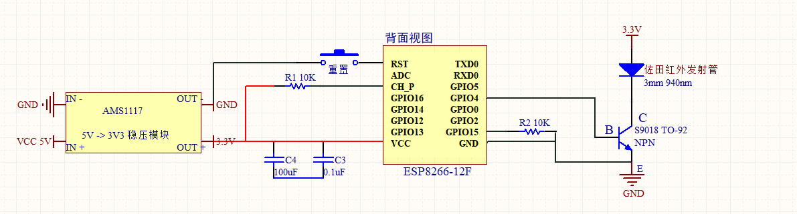

# 目前已实现功能
1. 加入了ha-inkwavemap，本地化 Home Assistant 的地图面板
2. 晚上9点左右，提醒孩子刷牙，读书，休息等。
3. 工作日播报天气和路况，提示是否开窗。
4. 语音识别：播放/关闭音乐，控制客厅/主卧/卧室灯具
5. 增加了整点和半点使用布谷鸟报时，并根据中国的假期安排调整播报时间。using omxplayer instead of vlc . 
6. 定时让esp8266 休眠达到省电的目的。
# 增加客厅和次卧的ESP8266控制。 或者可以考虑次卧的不做。
# ESP8266电路图

